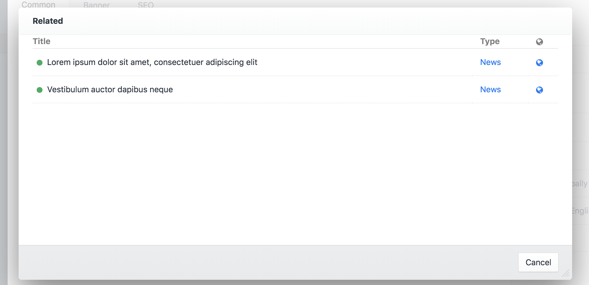

# Related plugin for Craft CMS 3.x

A simple plugin that adds a widget within the Craft CP page sidebar, allowing you to quickly and easily access related entries.

## Requirements

This plugin requires Craft CMS 3.0.0-beta.23 or later.

## Installation

To install the plugin, follow these instructions.

1. Open your terminal and go to your Craft project:

        cd /path/to/project

2. Then tell Composer to load the plugin:

        composer require wrav/related

3. In the Control Panel, go to Settings → Plugins and click the “Install” button for Related.

## Change Log

Changes can be viewed [here](https://github.com/wrav/related/blob/master/CHANGELOG.md)

## Support

Get in touch via email or by [creating a Github issue](/wrav/related/issues)

## Show your Support
This is licensed under the MIT license meaning it will always be free. If you like the plugin, please feel free to show your support and buy me a :beers:. 

